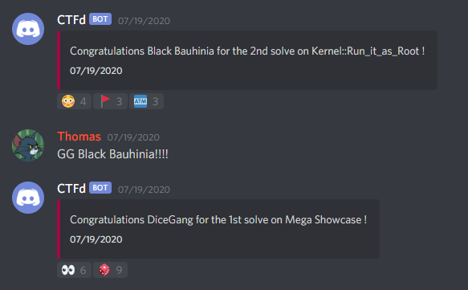

# ctfd-discord-webhook-plugin

Discord webhook plugin for CTFd to announce challenge solves! Can be configured with a custom message, and a limit to only announce the first N solves.

The webhook are called only when the CTF is started. Don't attempt to test as an admin if the CTF is not started: the webhook will not be triggered.

Functionality made for UIUCTF 2020

## Setup
1. Clone this repo into a folder in the plugin folder of your CTFd
2. Create a new Webhook in your discord server
3. Set the appropriate `DISCORD_WEBHOOK_URL`, `DISCORD_WEBHOOK_LIMIT`, `DISCORD_WEBHOOK_MESSAGE` environment variables or edit the `config.py` file.

If you are using docker-compose to deploy ctfd, I recommend setting the env variables within your docker-compose.yml file. Run `docker-compose build` and `docker-compose up` to rebuild and relaunch ctfd w/ the plugin included.

